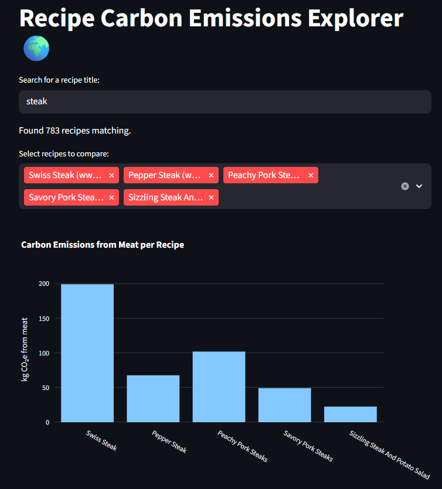

# Week 8 Homework

### The main goal of this repository is to Utilize *RecipeNLG* by [Michał Bień et al](https://aclanthology.org/2020.inlg-1.4/) to form a novel anlysis of the large curated dataset. 


First we need to [download](https://recipenlg.cs.put.poznan.pl/) the curated .csv

Then, as per the author's recommendation, we [filter and subset the data based on source=Gathered](https://github.com/Aswystun/CBC/blob/main/Week8/Week8/data/01_data.py), using full_data.csv as input and outputing gathered.csv. This gave us a subset of around 1.6 million recipes.

Next, to make processing manageable, I have [created a further subset of 200,000 random lines from the gathered.csv](https://github.com/Aswystun/CBC/blob/main/Week8/Week8/data/02_subset.py), and output gathered_short.csv.


To help aid in answering further questions, a unit map was created by[counting the most used ingredients](https://github.com/Aswystun/CBC/blob/main/Week8/Week8/data/03_unit_map_creation.py) in recipes that include red meat keywords, as well as [counting the most used red meats options](https://github.com/Aswystun/CBC/blob/main/Week8/Week8/data/03b_unit_map_creation.py) in these recipes as well. 


 I searched through the data with keywords of different types of red meat options found in steps 3 and 3b, and counted how many times that keyword was matched in groups. After a couple of interations [04_cleaning.py](https://github.com/Aswystun/CBC/blob/main/Week8/Week8/data/04_cleaning.py), and [04bcleaning.py](https://github.com/Aswystun/CBC/blob/main/Week8/Week8/data/04b_cleaning.py) I had a good criteria for step 5

I used the criteria to [refine the subset gathered_short.csv to an even more manageable size, only including recipes that match my categories](https://github.com/Aswystun/CBC/blob/main/Week8/Week8/data/05_refiner.py). 

we went from 200,000 recipes to 18,958.

Next, I am exploring the ecological burden it would take to produce these meals.

So first, I [fetch the environmental data](http://github.com/Aswystun/CBC/blob/main/Week8/Week8/data/06_emissions.py) from [this article](https://ourworldindata.org/grapher/food-emissions-supply-chain), then I add a total column of the sums of the emissions columns.


then I [cross-referenced the total amount of emissions from the emissions csv for each meat type](https://github.com/Aswystun/CBC/blob/main/Week8/Week8/data/07_parsing.py),
and added that onto the end of the recipe row, then after a couple of iterations [07b_parsing.py](https://github.com/Aswystun/CBC/blob/main/Week8/Week8/data/07b_parsing.py)-[07f_parsing.py](https://github.com/Aswystun/CBC/blob/main/Week8/Week8/data/07f_parsing.py) I decided to leave out all liquid beef broth recipes, rows that came up with 0, and included some inconspicuous recipes that were left out in the first few iterations.


Lastly,
I used [streamlit](https://streamlit.io/) to [make an app that uses my parsed.csv list, that includes the amount of carbon emissions it would have taken for the amount of meat required for the recipe.](https://github.com/Aswystun/CBC/blob/main/Week8/Week8/data/08_app.py) 

to use the app:

```python
streamlit run 08_app.py
```
then it will give you a local url, which you can copy and paste into the web browser, and it will graph the amount of emissions each recipe in that list uses. 


